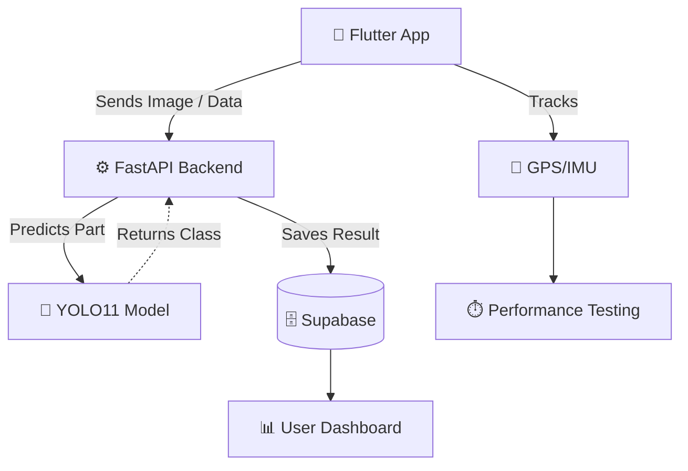

**I am an AI/ML Engineer and final-semester BS Artificial Intelligence student at FAST-NUCES, focused on building deployable AI systems that combine strong model development with clean, usable product interfaces.**

My work spans **Computer Vision, RAG pipelines, LLM applications, NLP systems, FastAPI backends, Supabase/PostgreSQL databases, Streamlit dashboards, and full-stack AI products**.

*Currently open to Summer 2026 AI/ML Engineering and Full-Stack Software Development opportunities.*

 

## 🛠️ Tech Stack & Skills

  
  **AI / ML**  
  
  
  
  
  
  

    

  **Backend / Full-Stack / DB**  
  
  
  
  
  
  

 

## 🚀 Flagship Project

### 🚘 OmniDrive AI — Intelligent Automotive Diagnostic Ecosystem

My Final Year Project: an end-to-end automotive AI platform combining computer vision, backend APIs, mobile engineering, diagnostics, and marketplace workflows.

**Core Stack:** Flutter, FastAPI, YOLO11-Large, Supabase, Firebase, Sensor Fusion, OBD-II

#### What it does:
- 🎯 Trained and integrated a **YOLO11-Large** classifier for 50 car-part classes using 26,820 images.
- ⚡ Served top-5 predictions through a **FastAPI** `/predict` endpoint.
- 🗄️ Stored scan history and user data in **Supabase**.
- ⏱️ Built GPS/IMU-based performance testing for 0–60, 0–100 km/h, quarter-mile, and braking metrics.
- 🛒 Designed marketplace flows for customers, vendors, riders, and admins.

 

## 💻 Featured AI/ML Projects

### 🌿 Serene — AI Wellness Companion
Empathy-driven mental health support chatbot with fine-tuning, emotion detection, retrieval, memory, and safety handling.
> **Stack:** GPT-Neo, LoRA, DistilRoBERTa, FAISS, Supabase, Streamlit

- Fine-tuned GPT-Neo-125M with LoRA.
- Local emotion detection & FAISS-based wellness retrieval.
- Supabase conversation memory & Crisis keyword safety overrides.

### 🏡 Luxe Estate — House Price Regression
Big-data regression pipeline for housing price prediction using optimized ML workflows and a usable estimator interface.
> **Stack:** XGBoost, Scikit-learn, Pandas, Streamlit, Docker

- Expanded 1M+ row housing dataset with memory downcasting & feature engineering.
- Optimized XGBoost training paired with a Streamlit price-estimator UI.

### 📄 DocuMind — Context-Aware RAG Chatbot
Document-grounded chatbot using embeddings, vector search, memory, and LLM inference.
> **Stack:** LangChain, FAISS, MiniLM, Hugging Face, Streamlit

- Document chunking, MiniLM embeddings, and FAISS top-k retrieval.
- LangChain memory for grounded response generation.

### 📰 NewsLens and TicketIQ — Applied NLP Systems
NLP systems covering BERT fine-tuning and zero-shot/few-shot ticket classification.
> **Stack:** BERT, BART-large-MNLI, Hugging Face, Streamlit

- Fine-tuned BERT on AG News achieving 94% test accuracy.
- Built support-ticket auto-tagging with BART-large-MNLI (zero-shot and few-shot).

 

## 💼 Experience

- **AI/ML Engineering Intern** @ *DevelopersHub Corporation*
  > Built applied AI systems across LLMs, RAG, NLP classification, regression, and Streamlit deployment.
- **AI Developer Intern** @ *Nexium*
  > Built full-stack AI applications using React, Next.js, Supabase, n8n, Vercel, and Gemini API.
- **Teaching Assistant (Programming Fundamentals)** @ *FAST-NUCES*
  > Mentored students in C++ programming fundamentals, debugging, logic building, and project development.

 

## 📊 GitHub Activity & Stats

  
  

### 🐍 Contribution Snake

  <picture>
    <source media="(prefers-color-scheme: dark)" srcset="https://raw.githubusercontent.com/blackmangoo/blackmangoo/output/dist/github-contribution-grid-snake-dark.svg">
    <source media="(prefers-color-scheme: light)" srcset="https://raw.githubusercontent.com/blackmangoo/blackmangoo/output/dist/github-contribution-grid-snake.svg">
    
  </picture>

 

## 📫 Connect With Me

  

