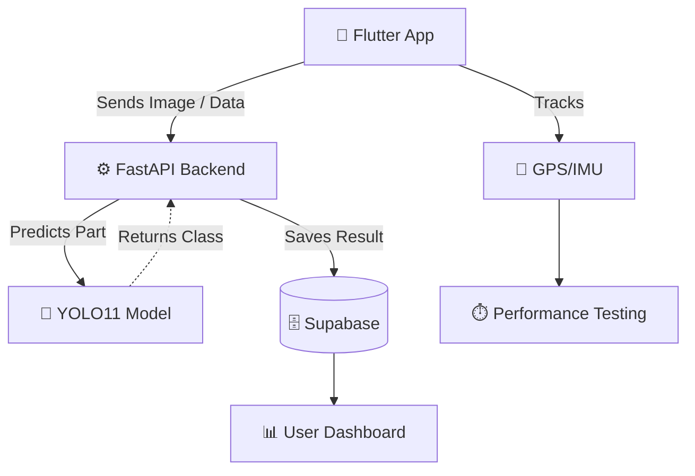

 

  

**I am an AI/ML Engineer and final-semester BS Artificial Intelligence student at FAST-NUCES, focused on building deployable AI systems that combine strong model development with clean, usable product interfaces.**

My work spans **Computer Vision, RAG pipelines, LLM applications, NLP systems, FastAPI backends, Supabase/PostgreSQL databases, Streamlit dashboards, and full-stack AI products**.

*Currently open to Summer 2026 AI/ML Engineering and Full-Stack Software Development opportunities.*

---

## 🛠️ Tech Stack & Skills

  <table style="border: none;">
    <tr>
      <td align="center" width="50%">
        <b>AI / Machine Learning</b>  
        
        
        
        
        
        
      </td>
      <td align="center" width="50%">
        <b>Backend / Full-Stack / DB</b>  
        
        
        
        
        
        
      </td>
    </tr>
  </table>

---

## 🚀 Flagship Project

### 🚘 OmniDrive AI — Intelligent Automotive Diagnostic Ecosystem

> **My Final Year Project:** An end-to-end automotive AI platform combining computer vision, backend APIs, mobile engineering, diagnostics, and marketplace workflows.
> 
> **Core Stack:** `Flutter` `FastAPI` `YOLO11-Large` `Supabase` `Firebase` `Sensor Fusion` `OBD-II`

**Key Highlights:**
- 🎯 Trained and integrated a **YOLO11-Large** classifier for 50 car-part classes using 26,820 images.
- ⚡ Served top-5 predictions through a high-performance **FastAPI** `/predict` endpoint.
- 🗄️ Managed scan history and structured user data securely in **Supabase**.
- ⏱️ Engineered GPS/IMU-based performance testing for 0–60, 0–100 km/h, quarter-mile, and braking metrics.
- 🛒 Architected complete marketplace flows for customers, vendors, riders, and admins.

<b>View Architecture Flowchart</b>

 

---

## 💻 Featured AI/ML Projects

<table width="100%">
  <tr>
    <td width="50%" valign="top">
      <h3>🌿 Serene — AI Wellness Companion</h3>
      
Empathy-driven mental health support chatbot with fine-tuning, emotion detection, retrieval, memory, and safety handling.

      <b>Stack:</b> <code>GPT-Neo</code> <code>LoRA</code> <code>DistilRoBERTa</code> <code>FAISS</code> <code>Supabase</code>
      

      <ul>
        <li>Fine-tuned <b>GPT-Neo-125M</b> with LoRA.</li>
        <li>Local emotion detection & FAISS-based wellness retrieval.</li>
        <li>Supabase conversation memory & Crisis keyword overrides.</li>
      </ul>
    </td>
    <td width="50%" valign="top">
      <h3>🏡 Luxe Estate — House Price Regression</h3>
      
Big-data regression pipeline for housing price prediction using optimized ML workflows and a usable estimator interface.

      <b>Stack:</b> <code>XGBoost</code> <code>Scikit-learn</code> <code>Pandas</code> <code>Streamlit</code> <code>Docker</code>
      

      <ul>
        <li>Expanded 1M+ row housing dataset with memory downcasting.</li>
        <li>Advanced feature engineering pipeline.</li>
        <li>Optimized XGBoost training paired with Streamlit UI.</li>
      </ul>
    </td>
  </tr>
  <tr>
    <td width="50%" valign="top">
      <h3>📄 DocuMind — Context-Aware RAG</h3>
      
Document-grounded chatbot using embeddings, vector search, memory, and local LLM inference.

      <b>Stack:</b> <code>LangChain</code> <code>FAISS</code> <code>MiniLM</code> <code>Hugging Face</code> <code>Streamlit</code>
      

      <ul>
        <li>Intelligent document chunking and MiniLM embeddings.</li>
        <li>FAISS top-k retrieval.</li>
        <li>LangChain memory for grounded contextual generation.</li>
      </ul>
    </td>
    <td width="50%" valign="top">
      <h3>📰 NewsLens and TicketIQ</h3>
      
Applied NLP systems covering BERT fine-tuning and zero-shot/few-shot ticket classification.

      <b>Stack:</b> <code>BERT</code> <code>BART-large-MNLI</code> <code>Hugging Face</code>
      

      <ul>
        <li>Fine-tuned BERT on AG News achieving 94% test accuracy.</li>
        <li>Built support-ticket auto-tagging with BART-large-MNLI.</li>
        <li>Implemented both zero-shot and few-shot paradigms.</li>
      </ul>
    </td>
  </tr>
</table>

---

## 💼 Experience

- **AI/ML Engineering Intern** @ *DevelopersHub Corporation*
  > Architected and deployed applied AI systems utilizing LLMs, RAG techniques, NLP classification, structured regression models, and Streamlit-based web integrations.
  
- **AI Developer Intern** @ *Nexium*
  > Spearheaded full-stack AI applications integrating React, Next.js, and Supabase. Orchestrated complex n8n workflows and tapped into the Gemini API for generative AI capabilities.
  
- **Teaching Assistant (Programming Fundamentals)** @ *FAST-NUCES*
  > Guided and mentored students in C++ programming fundamentals, rigorous debugging, core logic building, and scalable project development.

---

## 📊 GitHub Activity & Stats

  
  

 

  

### 🐍 Contribution Grid

  <picture>
    <source media="(prefers-color-scheme: dark)" srcset="https://raw.githubusercontent.com/blackmangoo/blackmangoo/output/dist/github-contribution-grid-snake-dark.svg">
    <source media="(prefers-color-scheme: light)" srcset="https://raw.githubusercontent.com/blackmangoo/blackmangoo/output/dist/github-contribution-grid-snake.svg">
    
  </picture>

---

## 📫 Let's Connect

  
  &nbsp;&nbsp;
  
  &nbsp;&nbsp;
  

